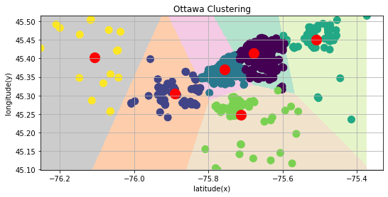
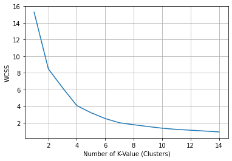

# Clustering
> Unsupervised learning in practice.
 
## Table of contents
* [General info](#general-info)
* [Screenshots](#screenshots)
* [Technologies](#technologies)
* [Status](#status)

## General info
This simple project groups points that are closely packed together (apartaments for rent), dealing with different shapes of clusters. 
Each one of 1400+ elements is assigned to the one of six clusters to the center of which it has the closest.
It is necessary to specify how many clusters are expected - it is known as common challenge with k-means that it cannot learn the number of clusters for the data.
This project can be helpful for the entrepreneurs willing to open chain stores in Ottawa.

Source of data: Airbnb, Ottawa, 2016

## Screenshots

## Technologies
* Python 3.8
* Spyder IDE 4.1.5
* Libraries:
        1. NumPy
        2. Pandas
        3. Pyplot from Matplotlib
        4. KMeans from Sklearn.cluster

## Status
This project is finished because it was just for learning.
However, it could be developed in the future.
